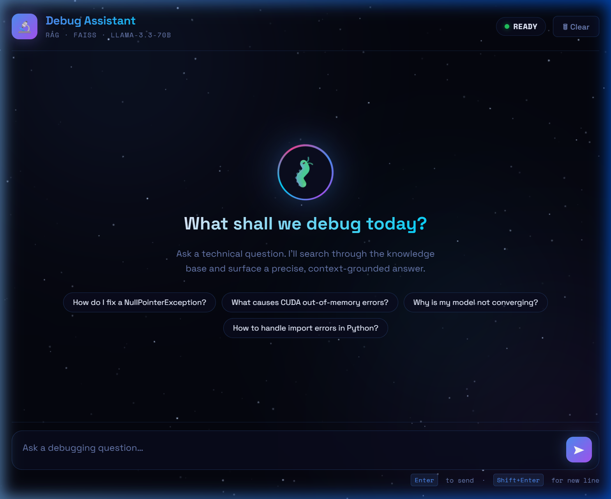

# 🔬 Technical Debug Assistant

A RAG (Retrieval-Augmented Generation) powered technical debugging assistant. It utilizes a fast vector search database, semantic text embeddings, and LLaMA-3.3-70b to deliver precise, context-grounded solutions for runtime stacktraces, configurations, and developer documentation.



---

## 🌟 Key Features

*   **🌌 Space-Themed UI**: A unique, responsive glassmorphic dashboard featuring an animated star-field background, glowing micro-animations, and a unified theme.
*   **📎 Live Knowledge Uploads**: Drag-and-drop or click to browse `.txt` and `.md` files. They are automatically chunked, embedded on the fly, and inserted into the running FAISS index.
*   **💻 Intelligent Code Formatting**: Beautiful code formatting featuring native language badges, macOS-style traffic light headers, and copy-ready styles.
*   **🔍 Context Grounding**: Inspect the exact documents, headings, and semantic proximity scores used to formulate responses via expandable accordion cards.
*   **⚡ Performance Metrics**: Displays semantic search and text generation performance benchmarks (in seconds) for every query.

---

## 🛠️ Tech Stack

*   **Backend**: [FastAPI](https://fastapi.tiangolo.com/) (Python)
*   **Vector DB**: [FAISS](https://github.com/facebookresearch/faiss) (Facebook AI Similarity Search)
*   **Embeddings**: `all-MiniLM-L6-v2` via [SentenceTransformers](https://www.sbert.net/)
*   **LLM**: LLaMA-3.3-70b via [Groq Cloud API](https://console.groq.com/)
*   **Frontend**: Native HTML5, modern HSL-defined CSS, and Vanilla JS

---

## 🚀 Setup & Installation

### 1. Prerequisites
Ensure you have Python 3.10+ installed.

### 2. Clone the Repository
```bash
git clone https://github.com/Mayank149/Technical-Debug-Assistant.git
cd Technical-Debug-Assistant
```

### 3. Install Dependencies
Set up a virtual environment and install the required packages:
```bash
python -m venv venv
# Windows
venv\Scripts\activate
# Linux/macOS
source venv/bin/activate

pip install -r requirements.txt
```
*(Note: If `requirements.txt` is missing, install the core packages directly: `pip install fastapi uvicorn python-multipart sentence-transformers faiss-cpu groq pydantic`)*

### 4. Configure Environment Variables
Copy `.env.example` to `.env` and enter your Groq API key:
```bash
cp .env.example .env
```
Open `.env` and set your key:
```env
GROQ_API_KEY = gsk_yourRealKeyHere...
```

### 5. Start the Application
Run the FastAPI development server:
```bash
uvicorn app:app --reload --port 5000
```
Open your browser and navigate to **[http://127.0.0.1:5000](http://127.0.0.1:5000)**.
